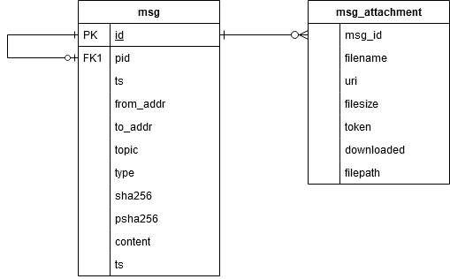

# Thead-Mail Posgres Store

## Config
Database connection details are loaded from environment, local `.env` file in same dir as `pgstore` executable will be loaded on startup.

List of environment variables here: https://www.postgresql.org/docs/current/libpq-envars.html

